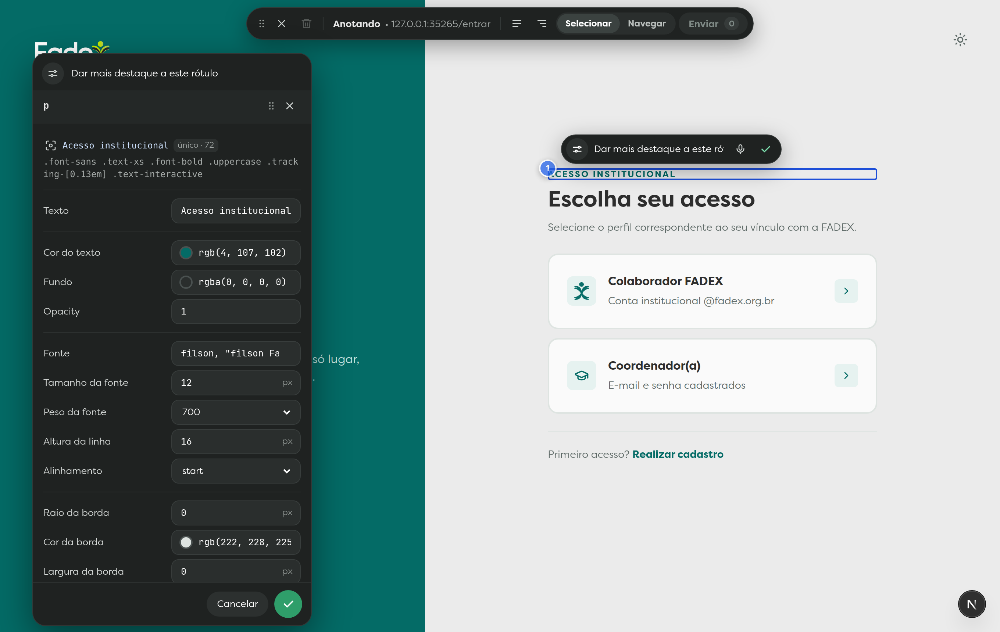
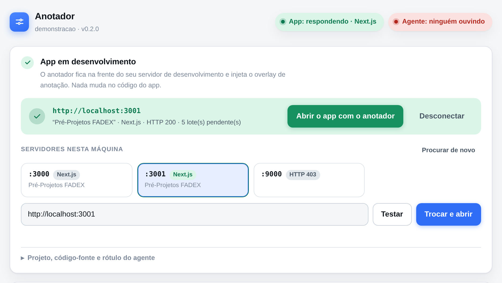
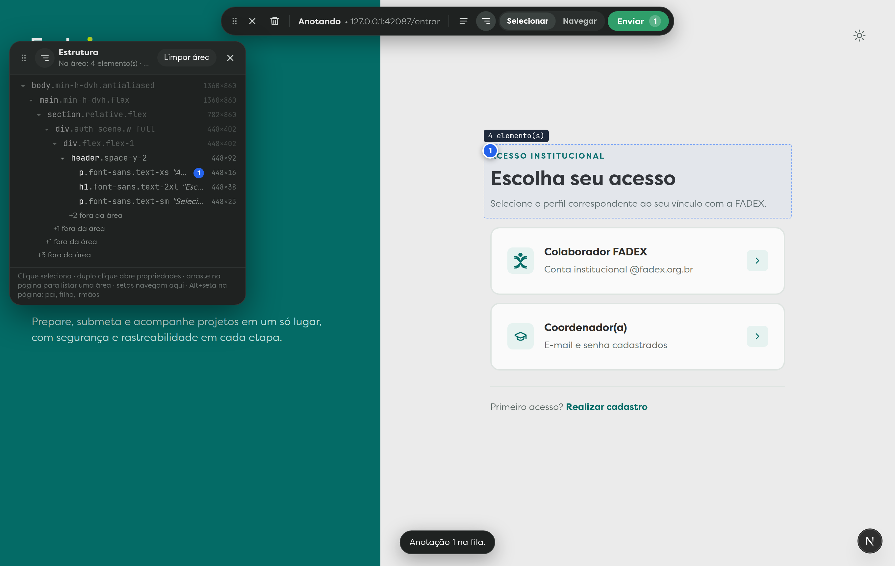
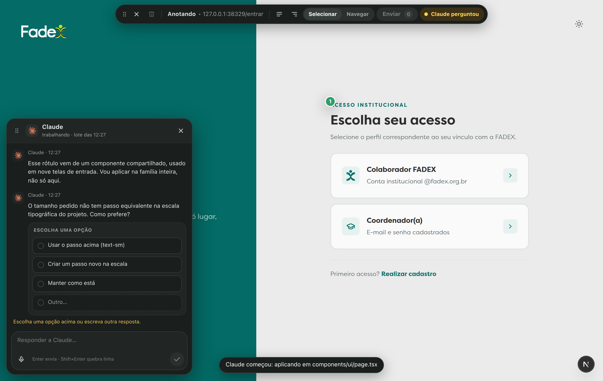
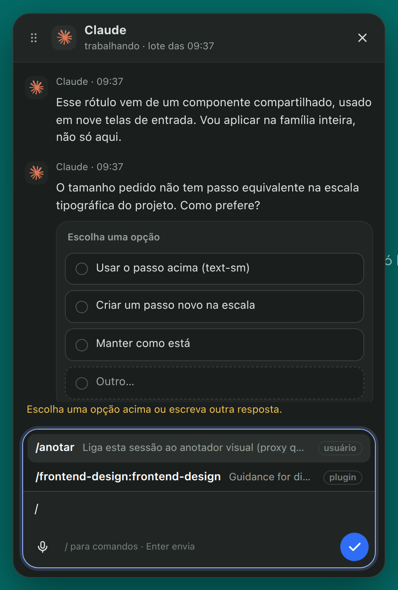
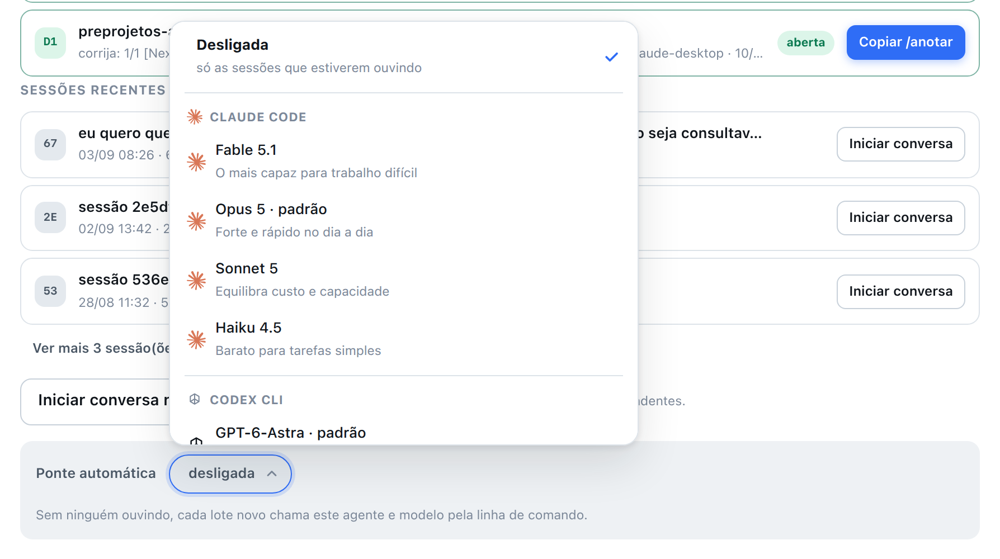
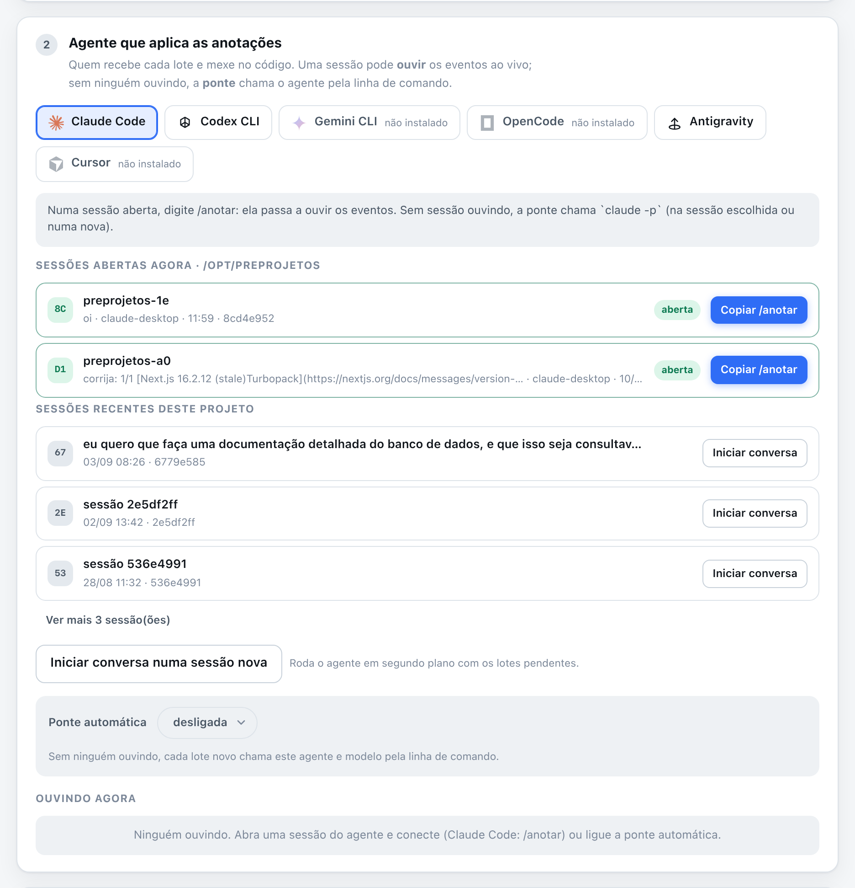
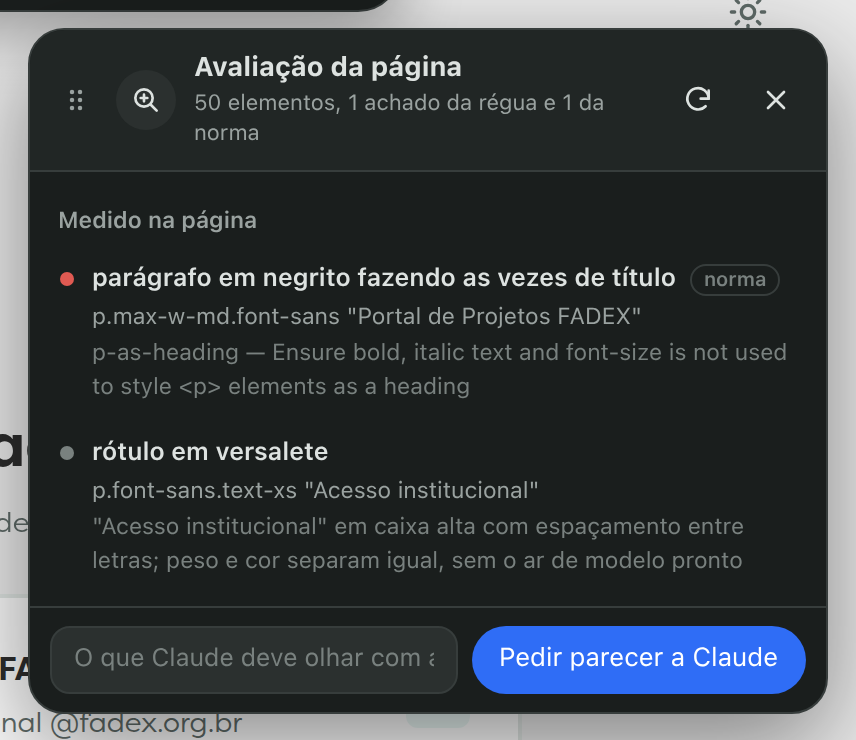

<p align="center">
  
</p>

<h1 align="center">anotador-ui</h1>

<p align="center">
  Anote a interface do seu app <b>em desenvolvimento</b> — selecione um elemento, comente, ajuste propriedades —<br>
  e entregue tudo a um <b>agente de código</b> como pedidos de mudança precisos, com conversa de mão dupla.
</p>

<p align="center">
  <a href="https://github.com/edinaldoof/anotador-ui/actions/workflows/ci.yml"></a>
  
  
  
</p>

<p align="center"></p>

Você aponta na tela. O agente recebe **onde aquilo está no código**, **qual classe governa cada propriedade** e **o que trocar** — e responde na própria página: progresso, explicações e perguntas com opções clicáveis.

Nada muda no código do app: um proxy reverso fica na frente do servidor de desenvolvimento e injeta o overlay respeitando a CSP da página.

```bash
npm install -g github:edinaldoof/anotador-ui
cd meu-projeto && anotador
```

Abra `http://localhost:3999/__anotador/`, escolha o app e comece.

No topo do menu, **Idioma da interface** permite escolher Português (Brasil), English ou Español. A preferência fica neste navegador e acompanha as outras abas do Anotador, incluindo chat, propriedades e extrator. O conteúdo do site, as mensagens, o DESIGN.md e o idioma do ditado permanecem como foram definidos. Com HTTPS habilitado, o menu encaminha para o endereço seguro para reutilizar a conexão do navegador.

---

## Índice

[Como funciona](#como-funciona) · [Instalação](#instalação) · [Conectar](#1-conectar-ao-app-em-desenvolvimento) · [Anotar](#2-anotar) · [Agente](#3-o-agente-aplica-e-responde) · [O que chega ao agente](#o-que-chega-ao-agente) · [Protocolo](#protocolo-para-qualquer-agente) · [Comandos](#comandos) · [Segurança](#segurança-e-limites)

## Como funciona

| | |
|---|---|
| **1. Conectar** | O anotador detecta os servidores em dev na sua máquina e fica na frente do escolhido. |
| **2. Anotar** | Clique num elemento, comente, ajuste propriedades com prévia ao vivo, **Enviar**. |
| **3. Aplicar** | O agente recebe o lote em Markdown, mexe no código e responde na própria página. |

Requisitos: **Node 22.18+** (roda TypeScript direto, sem build), um app em modo de desenvolvimento (Next.js, Vite, Nuxt, Angular, SvelteKit, Astro… qualquer coisa que responda HTML) e, opcionalmente, um Chromium para os prints de cada anotação.

## Instalação

```bash
npm install -g github:edinaldoof/anotador-ui
```

Ou clone e ligue o comando:

```bash
git clone https://github.com/edinaldoof/anotador-ui.git && cd anotador-ui && npm link
```

## 1. Conectar ao app em desenvolvimento

Na pasta do projeto — a varredura do código-fonte usa a pasta atual:

```bash
anotador
```

Abra **http://localhost:3999/__anotador/**. A página detecta os servidores rodando nas portas comuns, mostra framework e título de cada um, testa e conecta:

<picture>
  <source media="(prefers-color-scheme: dark)" srcset="docs/imagens/conexao-escuro.png">
  
</picture>

A conexão fica gravada por pasta: na próxima vez, `anotador` reconecta sozinho. As pílulas no topo dizem se o app responde e quantos agentes estão ouvindo. Também dá para usar a linha de comando:

```bash
anotador servir --alvo http://localhost:3000    # ou: anotador conectar <url> / desconectar
```

## 2. Anotar

Depois de conectar, o app abre em `http://localhost:3999/` com a barra do anotador no topo.

| Ação | Como |
|---|---|
| **Abrir menu principal** | o ícone de quatro quadrados no início da barra abre o menu do anotador em uma nova aba, mantendo a página e as anotações atuais |
| **Selecionar** | clique (o clique não chega ao app); `Alt` pega o elemento exato em vez do interativo pai |
| **Escolher o nível certo** | **Estrutura** (`Alt+R`) abre a árvore: ancestrais → elemento → filhos. Clicar numa linha troca a seleção **sem perder o comentário**; `Alt+↑↓←→` andam por pai, filho e irmãos |
| **Anotar vários elementos** | no modo Selecionar, **segure e arraste** um retângulo: o grupo mantém a área exata e lista os elementos inteiros ou parcialmente dentro dela |
| **Comentar** | balão ao lado do pin (`Enter` confirma; microfone dita em pt-BR) |
| **Controlar o ditado** | a barra junto à anotação mostra o estado do microfone; **X/Escape** cancela somente a fala, o quadrado para para revisão e a seta **Usar texto ditado** devolve o texto ao campo, sem enviar o lote |
| **Conversar com um agente** | o ícone de conversa na barra abre o chat. Escolha agente e modelo, escreva uma mensagem ou abra **Sessões existentes**; **Nova conversa** começa outro histórico |
| **Ajustar uma conversa** | os menus **Modelo da conversa** e **Raciocínio** mudam a próxima resposta preservando o histórico. Aguarde terminar uma resposta em andamento antes de trocar |
| **Monitorar consumo e contexto** | **Uso e contexto · Ver detalhes** abre tokens, custo reportado, cobertura e data da medição, com orientação sobre `/compact`. O botão **Uso** no cabeçalho mostra uma prévia da cota geral e abre diretamente os limites da conta |
| **Ler respostas e usar comandos** | o chat pode ser ampliado; respostas têm parágrafos, listas, tabelas e código copiável. Digite `/` ou clique **/ Comandos** para pesquisar a lista completa descoberta para o agente |
| **Ditar pela rede** | numa página HTTP, com HTTPS disponível no servidor, continua na mesma aba por HTTPS e restaura seleção, rascunho e prints. A permissão do navegador aparece junto à anotação; não abre outra janela |
| **Alterar propriedades** | painel com texto, cores, fonte, borda, tamanho, preenchimento e margem — prévia ao vivo, antes/depois registrado |
| **Usar a página** | modo **Navegar** (`Alt+A` alterna) |
| **Trocar agente/modelo** | ícone do agente na barra → agente instalado → modelo e raciocínio → **Usar seleção** |
| **Recarregar** | seta circular na barra preserva a fila, o comentário em edição, as prévias e o painel aberto |
| **Localizar e tirar print** | no painel de propriedades, a mira centraliza o elemento; **Tirar print da tela** salva um PNG no servidor e o anexa ao comentário, com miniatura, opção de baixar e remover |
| **Extrair design por URL** | globo na barra abre o extrator em outra aba, com prévia visual e download de **DESIGN.md**; YAML, blocos de código e a aba **Código** têm realce de sintaxe, preservando o conteúdo copiado e baixado |
| **Enviar** | a fila vira um lote; a barra acompanha do "aguardando" ao "Aplicado ✓" |
| **Mover/ocultar** | arraste pela alça de pontos; `Alt+Shift+A` oculta e reabre |



A fila fica no `localStorage` até ser enviada: recarregar a página ou o HMR do framework não perde nada, e as prévias são reaplicadas.

Uma anotação de área guarda as coordenadas em pixels CSS e até 100 referências de elementos, com aviso quando a lista atinge esse limite. O retângulo continua exato com rolagem e zoom, inclusive quando atravessa um iframe acessível. O painel mostra quais elementos ficaram parcialmente dentro da região; ele não aplica estilos ao contêiner ancestral. Os recortes automáticos dessas áreas usam os limites desenhados, sem a margem adicional usada nos recortes de elementos individuais.

O chat mantém as conversas no servidor por projeto e agente. Trocar o agente mostra somente as sessões dele e preserva a última conversa e o rascunho de cada um. Uma sessão nunca muda de dono: o servidor recusa leitura, configuração ou envio que informe outro agente. Abrir uma sessão ou escolher um modelo não envia um prompt: a execução começa em **Enviar mensagem**. Sessões nativas de Claude e Codex podem ser importadas do projeto; quando uma sessão está ativa no CLI, o chat permite consultar o histórico. A descoberta do Antigravity é parcial: o anotador verifica os IDs vinculados ao projeto nos registros locais, preserva o contexto ao retomar pelo próprio `agy` e informa que o histórico anterior continua no agente. As respostas novas ficam visíveis no chat. As respostas dependem do login e dos modelos disponíveis em cada CLI.

Agente, modelo e raciocínio ficam em um único controle junto à mensagem; clicar nele abre as opções. O campo cresce com o texto e inclui microfone para ditar, revisar e enviar. Falhas ao abrir uma sessão mostram qual conversa falhou, com **Tentar novamente** e **Voltar às sessões**, preservando os rascunhos. Na barra principal, passar o mouse ou focar o endereço abre um painel com a URL completa, selecionável, que acompanha a navegação do site.

O monitor **Uso e contexto** separa consumo acumulado (entrada, saída, cache, raciocínio e custo reportado) da ocupação atual disponível. Ele usa contadores dos CLIs e dos transcritos da própria sessão, sem estimar tokens por caracteres ou inventar preços e limites. Valores ausentes aparecem como **Não informado**. O custo em USD é o valor reportado pelo CLI, não a fatura da conta; a cobertura indica se a medição abrange a sessão, apenas o chat ou parte do histórico. Trocar de modelo invalida a medida anterior de contexto, preservando o consumo acumulado.

O mesmo painel separa os **limites da conta** dos contadores da sessão. As janelas e suas datas de renovação vêm do agente instalado: Codex pelo seu `app-server` e Claude pelo endpoint de uso da conta autenticada. A consulta não envia prompts nem cria conversas. Enquanto o chat está aberto, os dados são consultados a cada minuto; a interface mostra a última consulta e sinaliza quando só há um resultado anterior disponível. Uma conversa nova também pode mostrar limites da conta. Agentes sem uma fonte disponível apresentam essa condição, sem estimar porcentagens a partir dos tokens locais.

Quando existe uma janela de contexto medida, o monitor sinaliza atenção em 80% e proximidade do limite em 95%. São orientações para decidir se vale compactar, não limites impostos ao agente. **Sobre /compact** explica como agir na sessão do agente correto; `/compact` (ou `/chat:compact`, se houver comando instalado com esse nome) abre essa orientação e não envia um pedido comum ao modelo. A disponibilidade da compactação depende do CLI. O Antigravity não informa uma ocupação confiável no resultado final e não tem `/compact` confirmado nesta integração.

Cada anotação aceita até três prints manuais do site na posição atual da rolagem, com o elemento destacado. As imagens ficam guardadas no servidor e são incluídas no lote quando você confirma e envia a anotação; tirar print não aciona o agente sozinho. O Markdown contém a imagem, o caminho absoluto, a URL da página e as dimensões. Na ponte do Codex, os primeiros oito prints também entram como imagens do prompt; o Antigravity recebe acesso às pastas dos prints e orientação para inspecioná-los com as ferramentas visuais disponíveis. Remover a miniatura retira o anexo daquele rascunho, sem apagar arquivos já existentes no servidor.

### Extrair o design de um site

Abra `http://localhost:3999/__anotador/extrair` (também disponível pelo globo na barra ou pelo rodapé da conexão), informe uma URL HTTP(S) e clique em **Extrair design**. Requer Chromium instalado. A extração abre um navegador temporário e mantém o app conectado ao anotador.

A prévia reúne cores, tipografia, espaçamentos, raios, sombras, componentes e capturas em desktop e mobile. **Copiar Markdown** e **DESIGN.md** exportam os tokens em YAML e a documentação de layout, responsividade, seletores e referências de assets, no formato inspirado em [Dembrandt](https://github.com/dembrandt/dembrandt) e [Design Extractor](https://www.design-extractor.com/).

Os valores vêm do DOM e dos estilos computados em 1440×900 e 390×844. Nomes de tokens são gerados por frequência; não representam nomes oficiais da marca. A exportação registra as evidências e os limites da coleta: não faz login, não inspeciona canvas/iframes/Shadow DOM fechado e não testa estados de hover ou todos os breakpoints. Sites com bloqueios de automação ou conteúdo carregado só depois de rolar podem produzir uma amostra incompleta. Não exige serviço pago nem envia o resultado a agentes automaticamente.

Ao escolher um modelo explícito para receber anotações, o anotador usa a ponte de linha de comando com esse modelo; uma sessão de agente que já esteja ouvindo não tem seu modelo alterado pela interface.

A interface usa a fonte da Apple (San Francisco) quando ela existe — em iPhone, iPad e Mac, ou no Linux e Windows com a SF Pro instalada. Onde não existe, usa a fonte do sistema. Barra, chat, painéis e botão de reabrir mantêm essa tipografia sem herdar a fonte do site anotado. Os arquivos não vêm no repositório: a licença da Apple não permite redistribuir.

Em Linux e Windows, um comando resolve:

```bash
anotador fontes
```

Ele baixa de developer.apple.com, extrai e instala só na sua máquina — nada é redistribuído pelo repositório. `--compact` inclui a SF Compact (de relógio), `--forcar` reinstala. No Linux precisa de `p7zip-full` e `cpio`.

<details>
<summary>Fazer à mão, se preferir</summary>

Baixe de [developer.apple.com/fonts](https://developer.apple.com/fonts/) e extraia a cadeia `dmg` → `pkg` → `Payload`:

```bash
for f in SF-Pro SF-Compact SF-Mono; do
  curl -LO "https://devimages-cdn.apple.com/design/resources/download/$f.dmg"
  7z e "$f.dmg" -o"$f" "*.pkg" -r && 7z x "$f"/*.pkg -o"$f/pkg"
  (mkdir -p "$f/fontes" && cd "$f/fontes" && cpio -idm < ../pkg/Payload~)
done
mkdir -p ~/.local/share/fonts/apple-sf
find SF-* -name "*.otf" -o -name "*.ttf" | xargs -I{} cp {} ~/.local/share/fonts/apple-sf/
fc-cache -f ~/.local/share/fonts/apple-sf
```
</details>

## 3. O agente aplica e responde

A barra segue o ciclo em tempo real — *aguardando* → *aplicando em…* → *perguntou* → *aplicado ✓* — e cada lote tem uma conversa própria: o agente explica o que vai fazer, pergunta quando algo é ambíguo (com opções clicáveis) e você responde sem sair da página.

O painel **Anotações do lote** tem histórico de lotes e atalhos para conversas do agente, uso da conta e seleção de agente/modelo. Mensagens e passos publicados pelo agente são atualizados mesmo quando o status do lote não muda. Use o botão de ampliar ou arraste o canto inferior direito para redimensionar; com foco nesse canto, as setas ajustam o tamanho. Rascunhos ficam separados por lote. Se o processo falhar, o painel informa a falha e mantém as anotações salvas; encerrar o CLI não marca automaticamente o lote como concluído.



No campo da conversa, `/` abre os comandos do agente conectado, como a linha de comando faria. A lista é lida do disco: as skills e os comandos que o projeto declara, os da sua conta e os dos plugins ligados, cada um com a descrição e a origem. Setas escolhem, Enter completa, o primeiro espaço começa os argumentos e fecha a lista.

No chat independente, os comandos personalizados são expandidos a partir dos arquivos instalados para o agente e o projeto escolhidos; o histórico mantém o comando que você digitou. A lista inclui skills do Codex, plugins habilitados do Claude e Codex e workflows do Antigravity. Comandos interativos exclusivos do terminal não ganham um equivalente automaticamente no navegador. As ações identificadas como **Chat**, como `/model` e `/effort`, controlam a conversa aberta. Se um comando instalado tiver o mesmo nome, ele mantém a prioridade; use `/chat:model`, `/chat:effort`, `/chat:new`, `/chat:resume` ou `/chat:help` para acessar explicitamente as ações do chat.



Só entra o que existe no disco. Comandos embutidos do terminal, como limpar ou compactar a sessão, ficam de fora de propósito: valem para a sessão do terminal, não para uma mensagem que chega pelo anotador, e oferecê-los prometeria um efeito que não acontece.

O que o agente está fazendo aparece na própria conversa. Cada `anotador progresso` vira um passo na linha do tempo, com horário, e o último fica em destaque — a barra mostra só onde ele está agora, e o chat guarda o caminho até aqui.

Na barra, ao lado dos modos, a marca de quem recebe as anotações abre a lista de agentes desta máquina: quem está ouvindo ao vivo, quem pode ser chamado por linha de comando e quem não está instalado. Trocar ali vale para os próximos lotes, sem sair da página. Em outro aparelho, abra uma vez o **link de acesso** compartilhado pela página de conexão. O navegador fica conectado, inclusive nas outras abas e no extrator, sem digitar uma chave.

### Claude Code

```bash
ln -s "$(npm root -g)/anotador-ui/skills/anotar" ~/.claude/skills/anotar
```

Numa sessão do projeto, `/anotar`: ela sobe o anotador se preciso, liga o monitor de eventos identificando a sessão e passa a tratar cada lote como um pedido seu.

### Codex CLI, Gemini CLI, OpenCode

Escolha-os como **ponte** na página de conexão: a cada lote o anotador roda `codex exec` (ou `codex exec resume <sessão>`), `gemini -p` ou `opencode run` com um prompt que já traz o id do lote, o caminho do Markdown e os comandos para responder pela interface.

### Escolher o modelo

O seletor lista os modelos que existem **na sua máquina** — os do Claude Code e os que a sua conta do Codex libera, lidos do cache dele — com a marca do provedor, a descrição de cada um e os níveis de raciocínio que ele aceita:



As marcas vêm do [Simple Icons](https://simpleicons.org) (CC0) e do [svgl](https://svgl.app) (MIT), embutidas como traçado — sem dependência nova. As marcas em si pertencem a seus donos e aqui só identificam o produto. A escolha não é enfeite: vira argumento na chamada do agente (`claude --model opus --effort high`, `codex exec -m gpt-6-astra -c model_reasoning_effort="high"`), fica gravada com a conexão e aparece no cabeçalho da conversa, para você saber quem respondeu.



A página lista as **sessões do projeto** — as abertas agora e as recentes — e mostra quem está **ouvindo**. O Antigravity usa o CLI `agy`, quando instalado, e consulta `agy models` para oferecer os modelos disponíveis na conta. A ponte entrega os lotes com `agy -p` na pasta do projeto e mantém as permissões de comandos configuradas no CLI. Se houver apenas o aplicativo gráfico, ou um editor sem integração de CLI, abra a pasta do projeto e peça ao agente para ler `lotes/<id>.md` e usar a API.

## Sistema de design

O anotador lê os tokens que o projeto declara no CSS — inclusive **a intenção escrita no comentário ao lado** — e compara com o que a página realmente pinta. O que não casa é o achado: cor sem token, medida fora da escala, token que ninguém usa.

No overlay, o ícone de paleta (`Alt+D`) abre o explorador: cores, tamanhos de texto, espaçamentos e raios em uso, cada um com quantos elementos o usam e a qual token pertence. Passar o mouse acende na página todos os elementos daquele valor; clicar seleciona um para anotar. A aba **Fora do sistema** reúne o que escapou.

Pela linha de comando, para o agente ou para o relatório:

```bash
anotador design          # tokens, escala e achados acima de "baixa"
anotador design --tudo   # inclui token sem uso e cor repetida
anotador design --tokens > tokens.json   # os mesmos tokens no formato do W3C
```

O último exporta no **Design Tokens Format Module**, estável desde outubro de 2025 e lido por Figma, Style Dictionary, Tokens Studio e Penpot. `var(--outro)` vira referência `{cor.outro}`, o comentário do autor vira `$description` e cada token carrega em `$extensions` o nome da variável e o `arquivo:linha` de onde saiu — a viagem de volta continua possível. O que o formato não representa fica de fora com o motivo impresso, porque inventar uma forma aproximada é pior do que declarar a ausência.

As regras foram calibradas contra projetos reais, porque linter que grita demais ninguém lê:

| Regra | O que conta como defeito |
|---|---|
| espaçamento fora da escala | valor que não é múltiplo do passo que a maioria dos tokens respeita; exceção documentada no comentário cai para gravidade baixa |
| cor literal repetida | dois tokens escrevendo o mesmo valor. `--color-text-main: var(--color-brand-ink)` é alias e **não** conta: alias é o jeito certo de dar nome semântico |
| token sem uso | nem `var()` nem utilitária derivada o referenciam; prefixo de biblioteca é sinalizado à parte, porque ela lê a variável em tempo de execução |

## Avaliação da página

A lupa na barra (`Alt+E`) mede a página com uma régua objetiva e, se você quiser, pede um **parecer ao agente conectado**. São duas coisas separadas de propósito:

**A régua** roda no navegador e não opina — mede. Quinze regras: contraste contra o mínimo da norma, alvo de toque, campo sem rótulo, botão sem nome, salto e inversão de nível nos cabeçalhos, transbordo que faz a página rolar de lado, texto cortado, elemento a poucos pixels de uma coluna que os irmãos respeitam, raio e altura desiguais entre controles vizinhos, e vãos irregulares numa mesma linha. Cada achado traz o seletor, e passar o mouse acende o elemento.

As três últimas vêm da lista de *tells* que a Anthropic publica na skill [frontend-design](https://github.com/anthropics/claude-code/blob/main/plugins/frontend-design/skills/frontend-design/SKILL.md): rótulo em caixa alta com espaçamento entre letras, seta presa ao fim de um rótulo que já é clicável, e três informações emendadas por ponto médio. Nenhuma é erro. Todas são sinal de que a tela foi montada com o repertório padrão em vez de com o assunto dela, e por isso saem com gravidade baixa e no máximo três linhas cada.

**O motor emprestado** entra quando o projeto anotado já tem o `axe-core` instalado — e todo projeto Next com o lint padrão tem, por transitividade. O anotador o serve a partir do `node_modules` do próprio projeto, sem virar dependência de nada, e some sem alarde onde não houver. Ele mede o que a régua não mede: ARIA, semântica, landmarks, tabelas. Sete regras normativas que o motor entrega **desligadas de fábrica** são ligadas aqui pelo nome, entre elas o alvo de toque da WCAG 2.2 — quem roda o motor puro recebe um verde que não mediu o que diz medir. Fora ficam o nível AAA, os critérios que a WCAG 2.2 removeu e as regras experimentais, cada exclusão com o motivo escrito no código. Achado que repete o que a régua já disse sobre o mesmo elemento não aparece duas vezes, e a régua ganha o empate: ela tem calibração que a norma não tem, como a exceção do próprio critério 2.5.8 para link no meio de um parágrafo. No painel, o que veio de fora leva o selo `norma`.

**O parecer** é do agente. O anotador monta um dossiê com tudo que já foi medido, a estrutura da página, os componentes em cena, o sistema de design com a intenção de cada token, e a captura da tela; então pede que ele julgue só o que a régua não alcança — hierarquia visual, clareza da ação principal, consistência, densidade, elegância. Cada item volta apontando um elemento, o problema e uma sugestão na linguagem do projeto, com botão para virar anotação e você mandar aplicar.

Com a ponte configurada, cada pedido abre uma **conversa de avaliação** no chat, com agente, modelo e ID da sessão. As mensagens públicas da execução e os contadores disponíveis aparecem ali. O botão **Abrir chat** no painel retoma a mesma conversa, inclusive depois de recarregar a página. Enquanto a avaliação está em andamento, novos envios e alterações de modelo dessa conversa ficam bloqueados; ao terminar, você pode continuar com o mesmo agente.

Para pedir outra avaliação, use **Trocar agente** no próprio painel, escolha agente, modelo e raciocínio e clique em **Iniciar com…**. O pedido abre uma nova conversa no chat. Cada avaliação mantém seu agente e histórico; essa escolha vale apenas para o novo pedido. Cancelar ou receber um erro no envio mantém a avaliação anterior acessível.

O parecer é recebido diretamente da saída estruturada do CLI, sem exigir que o processo consiga acessar o servidor por HTTP. O retorno por `POST /avaliacoes/<id>/parecer` continua disponível para integrações que escutam os eventos. Se a execução falhar ou não entregar um parecer válido, o chat conserva as mensagens disponíveis e mostra o estado; consultar novamente nunca inicia outra análise.



```bash
anotador avaliacoes       # pedidos, com e sem parecer
anotador avaliacao <id>   # o dossiê e o parecer
```

O dossiê também carrega **o porquê que está escrito no código**: os blocos de comentário dos arquivos daquela rota, mais um `.anotador/contexto.md` se o projeto quiser declarar público e objetivo. Isso existe porque layout se mede, propósito não — duas opções lado a lado podem ser dois públicos diferentes, e sem esse contexto o parecer vira palpite. Quando a resposta não está em lugar nenhum, o agente manda uma **pergunta com opções** em vez de afirmar, e ela aparece no painel para você responder com um clique.

A separação importa: a régua nunca inventa, e o agente nunca precisa adivinhar o que já foi medido. As regras são testadas contra uma página com defeitos de propósito — cada uma precisa acender lá e ficar calada numa página bem-feita.

## O que chega ao agente

Cada lote gera em `~/.claude/anotacoes/<projeto>/` (`ANOTADOR_HOME` troca a base):

As novas anotações incluem uma referência visual capturada no clique: estilos, dimensões e área de conteúdo do elemento e de até dois containers acima dele. O painel **Contexto da seleção** mostra um resumo; o Markdown e o JSON levam os detalhes ao agente. Essa coleta aproveita a abordagem do extrator de design para explicar problemas de layout, sem abrir outro site ou executar uma extração completa a cada comentário. Os valores registram a situação antes das edições, na largura de tela daquele momento.

- **`lotes/<id>.md`** — por anotação: o comentário, seletores ranqueados por robustez, classes, texto visível, cadeia de ancestrais, componentes React lidos da fiber, HTML do elemento, **onde está no código** (`arquivo:linha` rastreados por id, classes, texto e definição de componente, priorizando o que a rota alcança) e uma tabela de **como aplicar** (classe atual → utilitária sugerida, com cores casadas aos tokens CSS do projeto, inclusive `oklch`).
- `lotes/<id>.json`, `lotes/<id>.instantaneo.html` (DOM com as edições e os pins), `lotes/<id>.conversa.jsonl` e `capturas/<id>/*.png` (página inteira e um recorte por anotação).
- `fila.jsonl` / `processadas.jsonl` (histórico) e `agentes/*.log` (saída das execuções da ponte).

<details>
<summary>Exemplo de trecho do Markdown</summary>

```markdown
## Anotação 1 — Dar mais destaque a este rótulo
- Elemento: `<p>` · componentes React: EscolhaDeAcesso, PaginaEntrar
- Melhor seletor: texto "Acesso institucional" em <p> — texto, único, 72 pts

### Onde está no código
- `components/ui/page.tsx:81` — classes completas (100 pts) · na rota
- `app/entrar/page.tsx:49` — texto (80 pts) · na rota

### Alterações de estilo e como aplicar
| Propriedade | Antes | Depois | Classe atual | Sugestão |
|---|---|---|---|---|
| `font-size` | `12px` | `14px` | `text-xs` | `text-sm` |
```
</details>

## Protocolo, para qualquer agente

Neutro de modelo: WebSocket para eventos, Markdown para o conteúdo, REST para responder.

```
ws://127.0.0.1:3999/__anotador/eventos?agente=Nome&sessao=opcional
   {tipo: lote|progresso|processado|mensagem|conexao, id, caminhoMd, resumo, arquivos}

GET  /__anotador/lotes?estado=pendente          GET /__anotador/lotes/<id>/md
POST /__anotador/lotes/<id>/progresso   {"nota":"aplicando em X"}
POST /__anotador/lotes/<id>/mensagens   {"autor":"agente","tipo":"escolha","texto":"…","opcoes":["A","B"]}
GET  /__anotador/lotes/<id>/conversa    # respostas (autor: usuario, responde: <id da pergunta>)
POST /__anotador/lotes/<id>/processado  {"nota":"o que mudou"}
```

O mesmo pela linha de comando, de qualquer terminal:

```bash
anotador pendentes
anotador ver <id>
anotador progresso <id> --nota "aplicando em components/ui/page.tsx"
anotador perguntar <id> --texto "Em todos os botões ou só neste?" --opcoes "Em todos|Só neste"
anotador processado <id> --nota "borda de 2px em todos os marcadores"
```

## Comandos

```
anotador                        sobe na porta 3999; reconecta ao último app desta pasta ou abre a página de conexão
anotador servir [--alvo URL] [--porta 3999] [--host 0.0.0.0] [--nome slug] [--saida dir] [--fonte dir] [--https]
                [--agente Claude] [--publico http://ip:porta] [--sem-csp] [--sem-capturas] [--chrome caminho] [--permitir-externo]
anotador conectar <url> | desconectar | saude | pendentes | ver <id> | conversa <id>
anotador fontes [--compact] [--forcar]         instala a San Francisco da Apple nesta máquina
anotador design [--fonte dir] [--tudo]         tokens do projeto e o que foge das próprias regras
anotador design --tokens                       os mesmos tokens no formato do W3C, na saída padrão
anotador avaliacoes | avaliacao <id>           pedidos de parecer e o dossiê de cada um
anotador progresso <id> --nota … | nota <id> --texto … | perguntar <id> --texto … [--opcoes "A|B|C"] [--multipla] | processado <id> [--nota …]
```

`--publico` informa a URL pela qual o navegador acessa o anotador quando há outro proxy na frente; `--permitir-externo` aceita alvos fora da máquina e da rede local.

## Como o proxy se comporta

- Reescreve só HTML de navegação (`Sec-Fetch-Dest: document`), injetando `<script nonce=… src="/__anotador/overlay.js">` com o nonce da própria página. Assets, RSC, JSON e o WebSocket do HMR passam intactos.
- Reescreve `Host`, `Origin`, `Referer` e `Location` para o app não perceber a porta diferente; a sessão autenticada vale, pois cookies não distinguem porta.
- Sem app conectado, qualquer navegação vai para a página de conexão; trocar o app não exige reiniciar.

## Segurança e limites

- Ferramenta de desenvolvimento: escuta em `0.0.0.0` para você anotar de outro aparelho da rede, e **só aceita como alvo** endereços da própria máquina ou da rede local.
- **Microfone e câmera exigem conexão segura.** O navegador trata `localhost` como seguro; HTTP pelo endereço da rede não.

  Quando você anota de outra máquina, o caminho mais curto é **encaminhar a porta por SSH**: nenhum certificado entra na história, porque a página passa a ser servida de `localhost`, e o tráfego ainda vai cifrado. Ao pedir o microfone pelo endereço da rede, o próprio anotador mostra o comando pronto:

  ```bash
  ssh -N -L 3999:localhost:3999 voce@192.168.0.10
  ```

  Com ele rodando, abra `http://localhost:3999` e o microfone funciona direto. Para não repetir o comando, guarde-o uma vez em `~/.ssh/config` na sua máquina:

  ```
  Host anotador
    HostName 192.168.0.10
    User voce
    LocalForward 3999 localhost:3999
  ```

  A partir daí, `ssh -N anotador` levanta o túnel. Quem abre o projeto pelo **Remote-SSH do VS Code** não precisa de nada disso: o editor já encaminha a porta para `localhost` sozinho. O celular, que não tem SSH, continua pelo endereço HTTPS.

  Com `anotador servir --https`, clicar no microfone continua na mesma aba por HTTPS, preservando anotações, prints e o rascunho, agente, modelo e sessão do chat. A retomada verifica o acesso do navegador antes de retornar ao app. Se necessário, o navegador pede para aceitar o certificado e permitir o microfone. A transferência autenticada expira em cinco minutos e só pode ser usada uma vez; recarregar a página não liga o microfone sozinho.

  Com a transcrição local instalada, o botão grava somente o microfone por até dois minutos. Escolha o idioma ao lado do botão: português, inglês, espanhol, francês, alemão ou italiano. A escolha fica guardada e acompanha a retomada por HTTPS. O servidor usa Whisper Small multilíngue em CPU, com idioma explícito e sem traduzir a fala. O modelo permanece carregado por alguns minutos para reduzir a espera entre gravações.

  Uma área abaixo dos controles mostra prévias conforme você fala; elas podem mudar na revisão do áudio completo. **Parar** conclui a transcrição e coloca o resultado no rascunho para revisão. Se houver falha, **Tentar novamente** reutiliza a gravação, sem pedir que você repita. **X/Escape** cancela e preserva o texto anterior. O áudio temporário é apagado ao terminar ou cancelar; não é enviado a serviço externo nem ao agente. A instalação é opcional e isolada, sem alterar o Python do sistema: `bash scripts/instalar-voz-local.sh` (requer `uv`; baixa dependências e modelo uma vez). Sem ela, o Anotador usa o reconhecimento de voz disponível no navegador, cujo serviço pode não funcionar em navegadores embutidos.

  O certificado próprio é gerado pelo `openssl` para `localhost` e os endereços da máquina; o navegador pode pedir que você o aceite na primeira visita. O certificado fica em `tls/` na pasta da fila e é refeito quando a máquina troca de rede. A mesma porta continua atendendo HTTP e WebSocket em texto claro para os agentes locais.
- As rotas que trocam a conexão, mexem na ponte ou **iniciam um agente** exigem identificação. Da própria máquina passam direto. Para conectar outro navegador, use **Copiar link de acesso** na página de conexão de um navegador já autorizado. O link vale por 15 minutos; ao abri-lo, o acesso fica salvo em cookie HttpOnly por 30 dias e funciona entre abas. Pedidos de outro site com esse cookie são recusados, e a credencial não é encaminhada ao app alvo. Para compatibilidade, a URL antiga impressa no terminal também conecta o navegador:

  ```
  de fora:   http://192.168.0.10:3999/__anotador/?chave=<32 dígitos>
  ```

  O servidor troca essa chave por uma sessão e redireciona para uma URL limpa, sem expor a chave no HTML. Credenciais de versões anteriores são migradas automaticamente. A chave raiz vive em `chave` na pasta da fila, com permissão só para o dono, e sobrevive a reinícios. Apagar o arquivo gera outra e invalida as sessões anteriores.

  Isso existe porque cabeçalho não autentica ninguém: quem manda o pedido também escolhe o `Origin` e o `Sec-Fetch-Site`. A rota que inicia um agente aceita um prompt de até 4000 caracteres e o entrega a um agente com acesso de escrita ao repositório, então ela precisava de mais que um cabeçalho.

  Uma ressalva: com um proxy reverso na sua frente (o caso de `--publico`), os pedidos chegam com o endereço do proxy, e se ele roda na mesma máquina tudo parece local. Nesse arranjo, quem controla o acesso é o proxy.
- A ponte roda o agente com permissões limitadas (`claude -p --permission-mode acceptEdits`, `codex exec --full-auto`) e guarda os logs em `agentes/`.
- Iframes de outra origem e texto de elementos com filhos não são editáveis; conteúdo de Server Component não traz componente React — a localização vai por classes e texto.

## Desenvolvimento

```bash
npm install     # só typescript e @types/node, para checagem
npm test        # tsc estrito (servidor e overlay) + unitários + integração + E2E no Chromium
node --disable-warning=ExperimentalWarning scripts/validar-real.ts --alvo http://localhost:3001 --rota /entrar --saida ./prints
node --disable-warning=ExperimentalWarning scripts/capturas-doc.ts --alvo http://localhost:3001 --rota /entrar   # imagens deste README
```

| Pasta | O quê |
|---|---|
| `server.ts` | proxy, API REST, WebSocket e linha de comando |
| `overlay/` | o que roda no navegador: engine de seleção, estilos e interface |
| `lib/` | fila em disco, análise do código-fonte, detecção de servidores e agentes, CDP, página de conexão |
| `skills/anotar/` | a skill do Claude Code |
| `tests/` | unitários, integração do proxy e ponta a ponta no Chromium |

A engine de precisão de seleção (snap para o interativo, candidatos ranqueados, ids dinâmicos, iframes, shadow DOM) foi portada do inspetor da extensão `fluxos-extension` do repositório `delta` da Fundação FADEX.

## Licença

MIT © [Edinaldo Filho](mailto:edinaldofilho2021@ufpi.edu.br)
